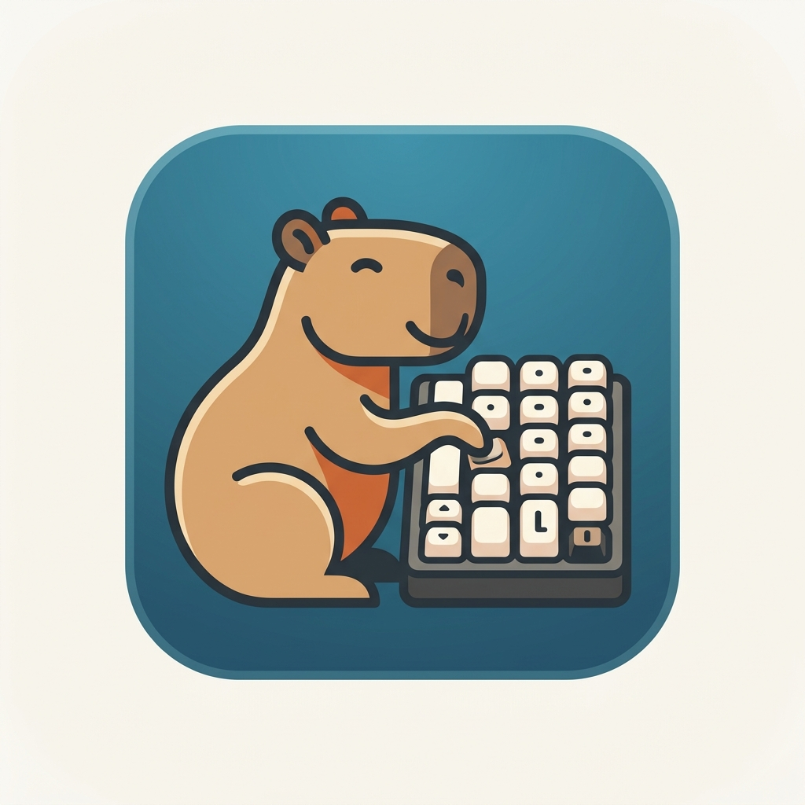

<div align="center">
  
  <h1>ThocKey</h1>
  <p><strong>A macOS menu-bar app for customizing your keyboard sound.</strong></p>

  [](https://opensource.org/licenses/MIT)
  []()
  []()
</div>

<br/>

ThocKey is a macOS 14 SwiftUI menu-bar app that lets you customize the sound of your keyboard. Bring the satisfying *thock*, *click*, or *clack* of a premium mechanical keyboard directly to your Mac, or use any custom sound for your keystrokes!

## Features

- 🎧 **Custom Key Sounds:** Play a satisfying sound on every key down and key up event.
- 🎛️ **Menu-Bar Native:** Lives quietly in your macOS menu bar for quick access to toggle sounds on and off.
- 🛠️ **Customizable:** Easily replace the default `thock_down.wav` and `thock_up.wav` files with your own `.wav` or `.mp3` audio files.
- ⚡ **Lightweight:** Built with SwiftUI and AVFoundation for minimal resource usage.

## Installation & Setup

1. **Clone the repository:**
   ```bash
   git clone https://github.com/yourusername/ThocKey.git
   cd ThocKey
   ```

2. **Build and Run:**
   Open `ThocKey.xcodeproj` in Xcode (requires Xcode 15+ and macOS 14+), or build from the command line:
   ```bash
   xcodebuild -project ThocKey.xcodeproj -scheme ThocKey -destination 'platform=macOS' build
   ```

3. **Accessibility Permissions:**
   The app requires Accessibility permissions to monitor global keystrokes. When you first launch the app, macOS will prompt you to grant this permission in **System Settings > Privacy & Security > Accessibility**.

## How to Use Custom Sounds

By default, the app uses `thock_down.wav` and `thock_up.wav` located in the root of the project. 

To use your own sounds:
1. Replace `thock_down.wav` and `thock_up.wav` in the project with your preferred audio files.
2. If your files have different names or formats (e.g., `.mp3`), update the resource lookups in `SoundManager.swift` and make sure they are bundled in your Xcode project's `Copy Bundle Resources` build phase.
3. Rebuild and launch the app!

## Development

- **App Structure:** `ThocKeyApp.swift` owns app startup and status-menu behavior, while `SoundManager.swift` handles AVFoundation playback.
- **Testing:** 
  Run unit and UI tests from Xcode, or via the command line:
  ```bash
  xcodebuild -project ThocKey.xcodeproj -scheme ThocKey -destination 'platform=macOS' test
  ```

## License

This project is licensed under the MIT License - see the LICENSE file for details.
